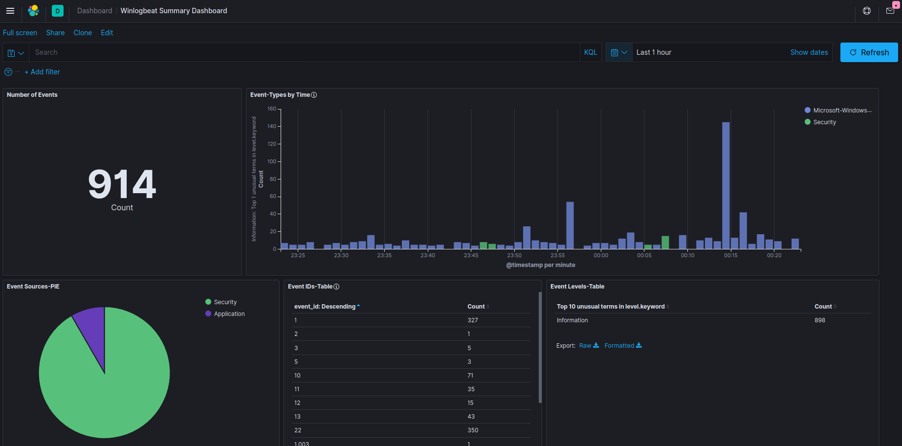
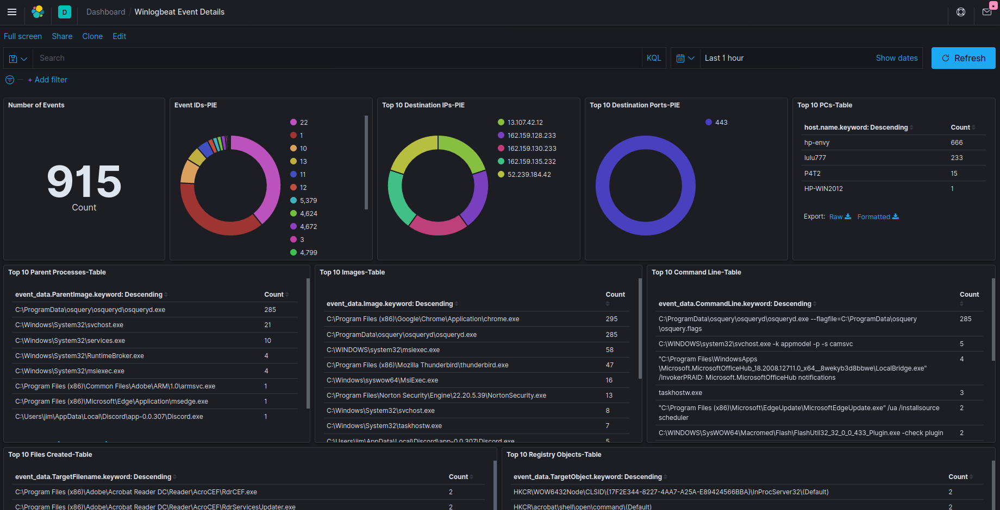

# This docker-compose project shows how to build an elasticsearch instance with a nginx basic authentication proxy

The docker-compose file creates four images:

1. elasticsearch (7.9.1)
2. logstash (7.9.1)
3. kibana (7.9.1)
4. nginx (1.19.2)

To download images, build and run the project run:

    docker-compose up -d

To clean up the project run:

    docker-compose down

This project was tested on Ubuntu 20.04 Desktop. A static IP (192.168.1.104) was given to the server and nginx was configured as a proxy with Basic Auth to allow remote access across my LAN. Users of this project will need to edit the nginx.conf file with the IP from their environment.

One of uses of this project is to be collector/analyzer of event data from Windows machines configured with winlogbeat to send data to the instance of elasticsearch built via this project. There are many other possible uses. Users of elasticsearch know it is relatively easy to create Dashboards summarizing any data collected.

Users of the project will also need to create their own htpasswd file. You can create this file by running the following command:

    echo "<your_user_name>:`openssl passwd -apr1 <your_user_password>`" | tee -a ./frontend/nginx/htpasswd

I have used earlier versions to create a complete Windows endpoint sysmon event analysis solution. Below are some example dashboards from my system:

